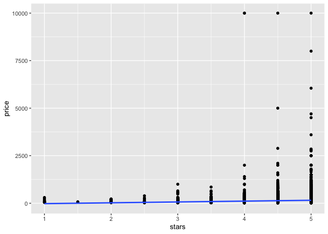
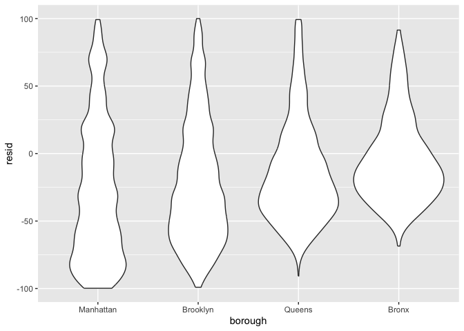
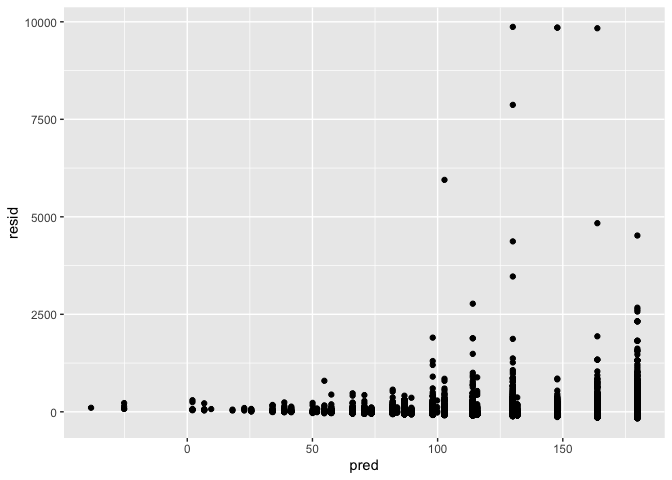

Linear models
================
Mingyin Wang
2024-11-7

``` r
library(tidyverse)
```

    ## ── Attaching core tidyverse packages ──────────────────────── tidyverse 2.0.0 ──
    ## ✔ dplyr     1.1.4     ✔ readr     2.1.5
    ## ✔ forcats   1.0.0     ✔ stringr   1.5.1
    ## ✔ ggplot2   3.5.1     ✔ tibble    3.2.1
    ## ✔ lubridate 1.9.3     ✔ tidyr     1.3.1
    ## ✔ purrr     1.0.2     
    ## ── Conflicts ────────────────────────────────────────── tidyverse_conflicts() ──
    ## ✖ dplyr::filter() masks stats::filter()
    ## ✖ dplyr::lag()    masks stats::lag()
    ## ℹ Use the conflicted package (<http://conflicted.r-lib.org/>) to force all conflicts to become errors

``` r
library(p8105.datasets)

set.seed(1)
```

do some cleanining

``` r
data("nyc_airbnb")

nyc_airbnb = 
  nyc_airbnb |> 
  mutate(stars = review_scores_location / 2) |> 
  rename(
    borough = neighbourhood_group,
    neighborhood = neighbourhood) |> 
  filter(borough != "Staten Island") |> 
  select(price, stars, borough, neighborhood, room_type)
```

## fit some models

``` r
fit = lm(price ~ stars, data = nyc_airbnb)
summary(fit)
```

    ## 
    ## Call:
    ## lm(formula = price ~ stars, data = nyc_airbnb)
    ## 
    ## Residuals:
    ##    Min     1Q Median     3Q    Max 
    ## -144.1  -69.1  -32.0   25.9 9889.0 
    ## 
    ## Coefficients:
    ##             Estimate Std. Error t value Pr(>|t|)    
    ## (Intercept)  -66.500     11.893  -5.591 2.27e-08 ***
    ## stars         44.115      2.515  17.538  < 2e-16 ***
    ## ---
    ## Signif. codes:  0 '***' 0.001 '**' 0.01 '*' 0.05 '.' 0.1 ' ' 1
    ## 
    ## Residual standard error: 183.8 on 30528 degrees of freedom
    ##   (9962 observations deleted due to missingness)
    ## Multiple R-squared:  0.009974,   Adjusted R-squared:  0.009942 
    ## F-statistic: 307.6 on 1 and 30528 DF,  p-value: < 2.2e-16

``` r
summary(fit)
```

    ## 
    ## Call:
    ## lm(formula = price ~ stars, data = nyc_airbnb)
    ## 
    ## Residuals:
    ##    Min     1Q Median     3Q    Max 
    ## -144.1  -69.1  -32.0   25.9 9889.0 
    ## 
    ## Coefficients:
    ##             Estimate Std. Error t value Pr(>|t|)    
    ## (Intercept)  -66.500     11.893  -5.591 2.27e-08 ***
    ## stars         44.115      2.515  17.538  < 2e-16 ***
    ## ---
    ## Signif. codes:  0 '***' 0.001 '**' 0.01 '*' 0.05 '.' 0.1 ' ' 1
    ## 
    ## Residual standard error: 183.8 on 30528 degrees of freedom
    ##   (9962 observations deleted due to missingness)
    ## Multiple R-squared:  0.009974,   Adjusted R-squared:  0.009942 
    ## F-statistic: 307.6 on 1 and 30528 DF,  p-value: < 2.2e-16

``` r
summary(fit)$coef
```

    ##              Estimate Std. Error   t value     Pr(>|t|)
    ## (Intercept) -66.50023  11.893232 -5.591435 2.271239e-08
    ## stars        44.11475   2.515452 17.537505 1.607832e-68

``` r
coef(fit)
```

    ## (Intercept)       stars 
    ##   -66.50023    44.11475

``` r
fit |> 
  broom::glance()
```

    ## # A tibble: 1 × 12
    ##   r.squared adj.r.squared sigma statistic  p.value    df   logLik     AIC    BIC
    ##       <dbl>         <dbl> <dbl>     <dbl>    <dbl> <dbl>    <dbl>   <dbl>  <dbl>
    ## 1   0.00997       0.00994  184.      308. 1.61e-68     1 -202491. 404989. 4.05e5
    ## # ℹ 3 more variables: deviance <dbl>, df.residual <int>, nobs <int>

``` r
nyc_airbnb = 
  nyc_airbnb |> 
  mutate(
    borough = fct_infreq(borough),
    room_type = fct_infreq(room_type))


fit = lm(price ~ stars + borough, data = nyc_airbnb)

fit |> 
  broom::tidy() |> 
  select(term, estimate, p.value) |> 
  mutate(term = str_replace(term, "borough", "Borough: ")) |> 
  knitr::kable(digits = 3)
```

| term              | estimate | p.value |
|:------------------|---------:|--------:|
| (Intercept)       |   19.839 |   0.104 |
| stars             |   31.990 |   0.000 |
| Borough: Brooklyn |  -49.754 |   0.000 |
| Borough: Queens   |  -77.048 |   0.000 |
| Borough: Bronx    |  -90.254 |   0.000 |

## Diagnostics

back track eda

``` r
nyc_airbnb |>
  ggplot(aes(x =stars, y= price)) +
  geom_point() +
  stat_smooth(method = "lm")
```

    ## `geom_smooth()` using formula = 'y ~ x'

    ## Warning: Removed 9962 rows containing non-finite outside the scale range
    ## (`stat_smooth()`).

    ## Warning: Removed 9962 rows containing missing values or values outside the scale range
    ## (`geom_point()`).

<!-- -->

``` r
nyc_airbnb |> 
  modelr::add_residuals(fit) |> 
  ggplot(aes(x = borough, y = resid)) + geom_violin() +
  ylim(-100, 100)
```

    ## Warning: Removed 14800 rows containing non-finite outside the scale range
    ## (`stat_ydensity()`).

<!-- -->

residuals against stars

``` r
nyc_airbnb |> 
  modelr::add_residuals(fit) |> 
  modelr::add_predictions(fit) |> 
  ggplot(aes(x= pred, y = resid)) + 
  geom_point()
```

    ## Warning: Removed 9962 rows containing missing values or values outside the scale range
    ## (`geom_point()`).

<!-- -->

## Hyp testing

``` r
fit_null = lm(price ~ stars + borough, data = nyc_airbnb)
fit_alt = lm(price ~ stars + borough + room_type, data = nyc_airbnb)
```

``` r
fit_null |>
  broom::tidy()
```

    ## # A tibble: 5 × 5
    ##   term            estimate std.error statistic   p.value
    ##   <chr>              <dbl>     <dbl>     <dbl>     <dbl>
    ## 1 (Intercept)         19.8     12.2       1.63 1.04e-  1
    ## 2 stars               32.0      2.53     12.7  1.27e- 36
    ## 3 boroughBrooklyn    -49.8      2.23    -22.3  6.32e-109
    ## 4 boroughQueens      -77.0      3.73    -20.7  2.58e- 94
    ## 5 boroughBronx       -90.3      8.57    -10.5  6.64e- 26

``` r
fit_alt |>
  broom::tidy()
```

    ## # A tibble: 7 × 5
    ##   term                  estimate std.error statistic  p.value
    ##   <chr>                    <dbl>     <dbl>     <dbl>    <dbl>
    ## 1 (Intercept)              113.      11.8       9.54 1.56e-21
    ## 2 stars                     21.9      2.43      9.01 2.09e-19
    ## 3 boroughBrooklyn          -40.3      2.15    -18.8  4.62e-78
    ## 4 boroughQueens            -55.5      3.59    -15.4  1.32e-53
    ## 5 boroughBronx             -63.0      8.22     -7.67 1.76e-14
    ## 6 room_typePrivate room   -105.       2.05    -51.2  0       
    ## 7 room_typeShared room    -129.       6.15    -21.0  2.24e-97

``` r
anova(fit_null, fit_alt)
```

    ## Analysis of Variance Table
    ## 
    ## Model 1: price ~ stars + borough
    ## Model 2: price ~ stars + borough + room_type
    ##   Res.Df        RSS Df Sum of Sq      F    Pr(>F)    
    ## 1  30525 1005601724                                  
    ## 2  30523  921447496  2  84154228 1393.8 < 2.2e-16 ***
    ## ---
    ## Signif. codes:  0 '***' 0.001 '**' 0.01 '*' 0.05 '.' 0.1 ' ' 1

## Do effects differ across boroughs

first use a lot of interactions

``` r
nyc_airbnb |> 
  lm(price ~ stars * borough + room_type * borough, data = _) |> 
  broom::tidy() |> 
  knitr::kable(digits = 3)
```

| term                                  | estimate | std.error | statistic | p.value |
|:--------------------------------------|---------:|----------:|----------:|--------:|
| (Intercept)                           |   95.694 |    19.184 |     4.988 |   0.000 |
| stars                                 |   27.110 |     3.965 |     6.838 |   0.000 |
| boroughBrooklyn                       |  -26.066 |    25.080 |    -1.039 |   0.299 |
| boroughQueens                         |   -4.118 |    40.674 |    -0.101 |   0.919 |
| boroughBronx                          |   -5.627 |    77.808 |    -0.072 |   0.942 |
| room_typePrivate room                 | -124.188 |     2.996 |   -41.457 |   0.000 |
| room_typeShared room                  | -153.635 |     8.692 |   -17.676 |   0.000 |
| stars:boroughBrooklyn                 |   -6.139 |     5.237 |    -1.172 |   0.241 |
| stars:boroughQueens                   |  -17.455 |     8.539 |    -2.044 |   0.041 |
| stars:boroughBronx                    |  -22.664 |    17.099 |    -1.325 |   0.185 |
| boroughBrooklyn:room_typePrivate room |   31.965 |     4.328 |     7.386 |   0.000 |
| boroughQueens:room_typePrivate room   |   54.933 |     7.459 |     7.365 |   0.000 |
| boroughBronx:room_typePrivate room    |   71.273 |    18.002 |     3.959 |   0.000 |
| boroughBrooklyn:room_typeShared room  |   47.797 |    13.895 |     3.440 |   0.001 |
| boroughQueens:room_typeShared room    |   58.662 |    17.897 |     3.278 |   0.001 |
| boroughBronx:room_typeShared room     |   83.089 |    42.451 |     1.957 |   0.050 |

``` r
  nyc_airbnb |> 
  filter(borough == "Manhattan") |>
  lm(price ~ stars + room_type, data = _) |>
  broom::tidy()
```

    ## # A tibble: 4 × 5
    ##   term                  estimate std.error statistic   p.value
    ##   <chr>                    <dbl>     <dbl>     <dbl>     <dbl>
    ## 1 (Intercept)               95.7     22.2       4.31 1.62e-  5
    ## 2 stars                     27.1      4.59      5.91 3.45e-  9
    ## 3 room_typePrivate room   -124.       3.46    -35.8  9.40e-270
    ## 4 room_typeShared room    -154.      10.1     -15.3  2.47e- 52

get fancy and use list columns

``` r
nyc_airbnb |> 
  nest(data = -borough) |> 
  mutate(
    models = map(data, \(x) lm(price ~ stars + room_type, data = x)),
    results = map(models, broom::tidy)) |>
  select(borough, results) |>
  unnest(results)|>
  select(borough, term, estimate) |> 
  mutate(term = fct_inorder(term)) |> 
  pivot_wider(
    names_from = term, values_from = estimate) 
```

    ## # A tibble: 4 × 5
    ##   borough   `(Intercept)` stars `room_typePrivate room` `room_typeShared room`
    ##   <fct>             <dbl> <dbl>                   <dbl>                  <dbl>
    ## 1 Bronx              90.1  4.45                   -52.9                  -70.5
    ## 2 Queens             91.6  9.65                   -69.3                  -95.0
    ## 3 Brooklyn           69.6 21.0                    -92.2                 -106. 
    ## 4 Manhattan          95.7 27.1                   -124.                  -154.
